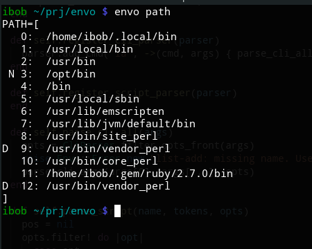

# Envy

A command-line environment variable manager for the current shell session. It works with bash and Windows cmd.

Envy offers several commands to view and change environment variables and also to execute simple scripts composed of those commands, thus allowing the same script for a particular env-var configuration on all supported platforms.

*Envy is still an alpha version. Not all features are complete and not everything is thoroughly tested.*

## Features

A screenshot of `envy path` which displays the path in a "pretty" way. Note the tags, `D` for an entry which is duplicated, and `N` for an entry which is a non-existing path



Use envy with `envy <command> <args>` in your terminal

### Commands

These are select envy commands. For a full list, check the [command reference](doc/commands.md)

* `show <name> ...` - show values of environment variables in a "pretty" format
* `set <name> = [<value>]` - set a value to an environment variable
* `unset <name> ...` - unset (delete) an environment variabls
* `list <name> add <value>` - add an element to an list environment variable (such as `PATH`)
* `clean <name>` - cleans environment variables. Unsets empty strings, non-existing paths, empty lists. Removes duplicates from lists and non-existing paths from path lists.
* `run <script>` - runs a simple script of commands. See the [script reference](doc/envyscript.md) on how to write scripts

## Installation

* You need a Ruby interpeter version 2.5 or higher
    * To check, type `ruby --version` in your terminal
* Install the ruby gem

```
$ gem install envy
```

* Install the envy command

```
$ envy-install
```

* *If you're using bash, after the last step you'll need to either restart the session, or source the file in which envy was installed (it will be logged after the installation)*

After this you can type

```
$ envy --help
```

... and see the commands and options supported by envy in your terminal.

## Contributing

Issues and pull requests are welcome.

Part of why I created this tool was to refresh my ruby-foo. I hadn't done much ruby programming for years before this. Because of this, envy is not great (not terrible) ruby code. I would welcome PRs or issues which improve the code style and introduce good practices and dev-tooling into the repo.

Please take a look at [the implementation notes](doc/impl-notes.md) and [the roadmap](doc/roadmap.md) if you want to contribute.

## License

This software is distributed under the MIT Software License. See accompanying LICENSE file or copy [here](https://opensource.org/licenses/MIT).

Copyright &copy; 2020 [Borislav Stanimirov](http://github.com/iboB)
